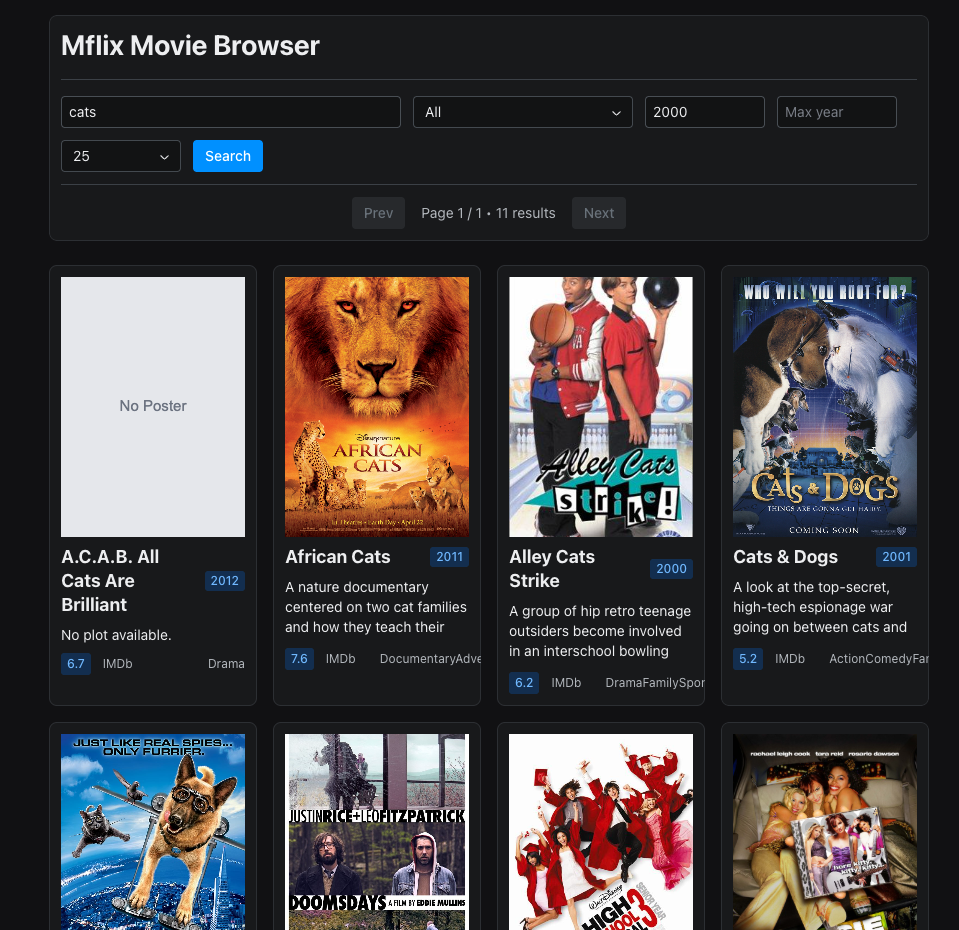

# Mflix Reflex Browser

A basic single-page application (SPA) built with **Reflex** + **PyMongo** that lets you **search and filter** the [MongoDB Sample Mflix Dataset](https://www.mongodb.com/docs/atlas/sample-data/sample-mflix/). It includes a responsive **Cards view**, **configurable page size**, and simple pagination.



## Purpose

This project can be used during a technical interview to assess the Python programming capabilities of a candidate. Successful completion of the assessment would result in a web application that can interact with a [MongoDB Atlas](https://www.mongodb.com/cloud/atlas) cluster that has been pre-loaded with the [`sample_mflix` dataset](https://www.mongodb.com/docs/atlas/sample-data/sample-mflix/).

>[!NOTE]
> During the assessment, the candidate should work through the following, while describing their thought process and demonstrating their ability to navigate and make sense of a foreign codebase:
> * Clone the repository
> * Install dependencies, configure the solution, start all processes and try navigating to https://localhost:3000
> * The page sizes of 10, 25, 50 and 100 seem like too many - remove 100 from the UI
> * Each movie contains an IMDB rating. Adapt the solution to enable filtering for movies with a rating greater than a given value, but less than 10:
>   * Update the UI to create a new component
>   * Update the main application to place the component
>   * Update the server to apply the ratings filter if present
>   * Validate the rating to ensure it is greater than 0 and less than or equal to 10
>   * Note that using the MongoDB Shell this might look like the following: `db.movies.find({ "imdb.rating": { $gte: 7.3 } })`


## Configuration

Create a `.env` file at the project root:

```dotenv
MONGODB_URI="mongodb+srv://<user>:<pass>@<cluster>/<optional_db>?retryWrites=true&w=majority"
MFLIX_DB="sample_mflix"
MFLIX_COLLECTION="movies"
```

### Notes

* `MFLIX_DB` and `MFLIX_COLLECTION` are optional (defaults match the sample dataset).
* If your Atlas IP access list is restricted, make sure your current IP is allowed.

## Run the App

```bash
reflex run
```

Then open:

* [http://localhost:3000](http://localhost:3000)

## How It Works

### Querying & Pagination

* The app builds a MongoDB query from the UI filters (search text, genre, year range).
* Results are sorted by `title` and fetched using `skip`/`limit` based pagination.

## Usage Tips

* Try searching for common titles like: `star`, `love`, `war`
* Use genre filtering to narrow a large result set quickly.


## License

MIT (or your preferred license).

